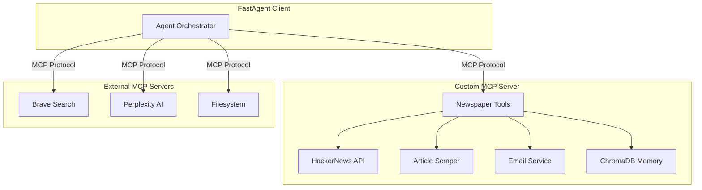
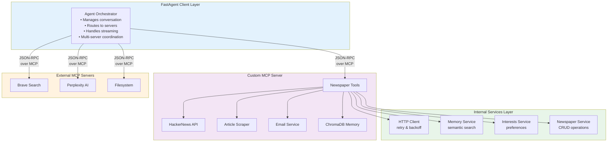
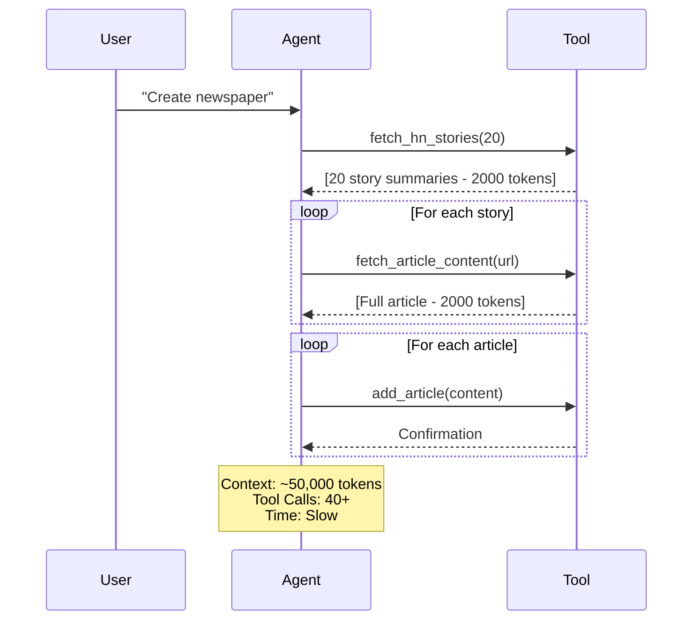
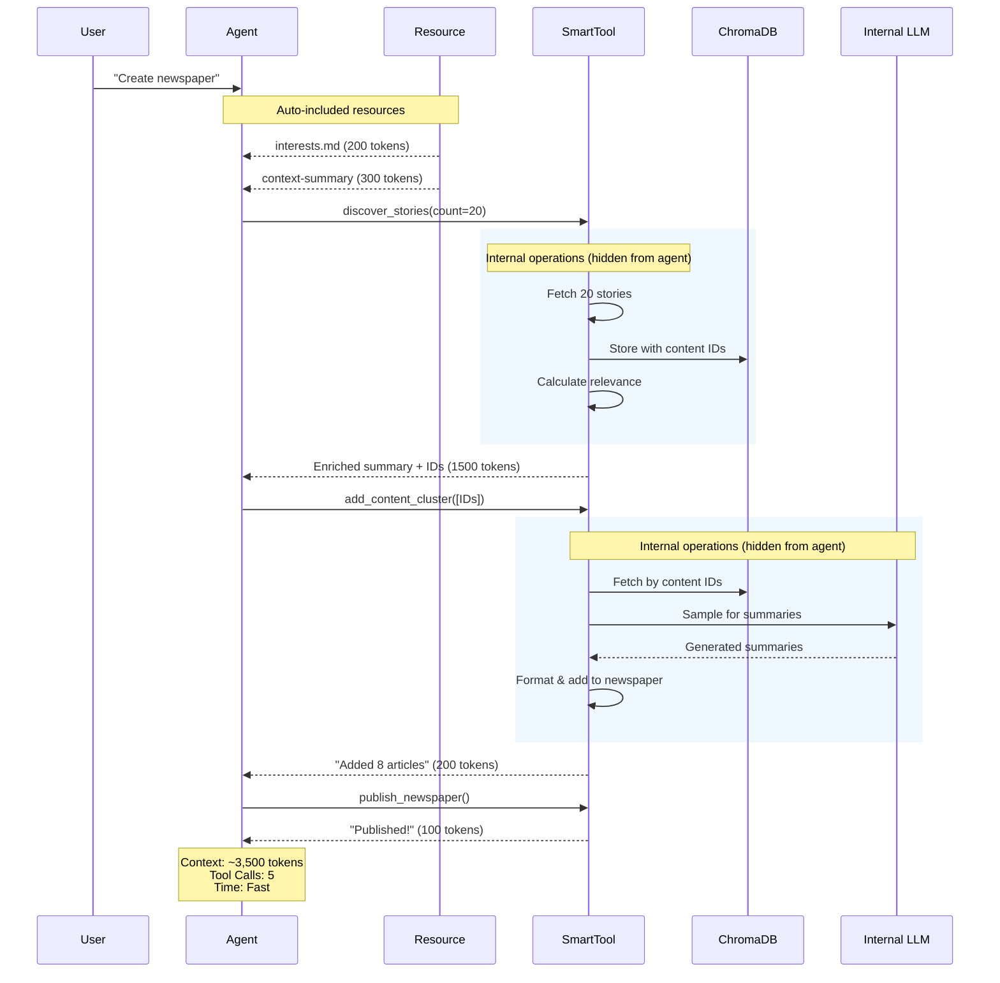

<div align="center">

# Agentic AI Workshop: Newspaper Creation Agent

[](https://www.python.org/downloads/)
[](https://github.com/jlowin/fastmcp)
[](LICENSE)

A comprehensive educational project demonstrating production-grade agentic AI through the Model Context Protocol (MCP). Build a personalized newspaper creation system using collaborative agents, vector memory, and modern AI patterns.

[Quick Start](#quick-start) · [Workshop Sessions](#workshop-sessions) · [Architecture](#architecture) · [Documentation](#documentation)

</div>

---

## Overview

### What This Is

This repository combines a **fully functional application** with an **educational workshop series** teaching agentic AI concepts through hands-on implementation. The project serves as both a production-ready newspaper agent and a comprehensive learning resource for building sophisticated AI systems.

**Educational Workshop Series:**
- Graduate-level course on agentic AI systems
- Progressive complexity across three sessions
- Real-world patterns and anti-patterns
- Production deployment considerations

**Functional Application:**
- Personalized newspaper creation and delivery
- Multi-source news aggregation
- Semantic filtering and ranking
- Beautiful HTML formatting with email delivery
- Vector-based memory and learning

### What You'll Learn

<table>
<tr>
<td width="33%">

**Core Concepts**
- Model Context Protocol
- Tool calling patterns
- Context management
- Memory systems
- Multi-agent coordination

</td>
<td width="33%">

**MCP Features**
- Tools & Resources
- Sampling (internal LLM calls)
- Elicitation (user input)
- Progress reporting
- Server lifecycle management

</td>
<td width="33%">

**Production Patterns**
- Error handling strategies
- Retry logic & backoff
- Context compression
- Quality validation
- Deployment architecture

</td>
</tr>
</table>

### What You'll Build

A sophisticated newspaper agent that:

- Aggregates news from HackerNews, web search, and AI research tools
- Filters and ranks content based on personal interests
- Creates beautifully formatted newspapers with multiple layout options
- Delivers via email with rich HTML templates
- Learns from your reading history and preferences over time
- Manages context efficiently for cost-effective operation

---

## Quick Start

### Make
```
# this start the mcp server
make build

# u can interact w the server by set up the client in whatever env
# 1. local env w venv
# 2. inside the same docker
# 3. call make client
```
### Prerequisites

```bash
python >= 3.13.7
uv (recommended package manager)
```

### Installation

```bash
# Clone repository
git clone https://github.com/yourusername/news-agent.git
cd news-agent

# Install dependencies
cd notebooks
uv pip install -e .

# Configure API keys
cp client/fastagent.secrets.yaml.example client/fastagent.secrets.yaml
# Edit fastagent.secrets.yaml with your OpenRouter API key

# Set environment variables
cp .env.example .env
# Edit .env with your email credentials (for newspaper delivery)
```

### Create Your First Newspaper

**Option 1: Interactive Agent**
```bash
cd client
python news-agent-client.py
```

Then type: `create_morning_brief` to use the built-in workflow prompt.

**Option 2: Jupyter Notebooks**
```bash
cd notebooks
jupyter notebook 01_basic_tools.ipynb
```

Run cells sequentially to build the agent step-by-step.

### Configuration

<details>
<summary>Click to see configuration options</summary>

**Client Configuration** (`client/fastagent.secrets.yaml`)
```yaml
openrouter:
  api_key: <your-key>

mcp:
  servers:
    brave:
      env:
        BRAVE_API_KEY: <your-key>
    perplexity_mcp:
      env:
        PERPLEXITY_API_KEY: <your-key>
```

**Server Configuration** (`src/server/config/settings.py`)
```python
class NewsSettings:
    default_story_count: int = 5
    summary_style: str = "brief"  # brief|detailed|technical
    sources: list[str] = ["hackernews"]

class HttpSettings:
    timeout: float = 15.0
    max_retries: int = 3
    retry_backoff_factor: float = 1.0
```

**Environment Variables** (`.env`)
```bash
OPENROUTER_API_KEY="your-api-key"
MCP_SMTP_PASSWORD="your-email-app-password"
MCP_SMTP_FROM_EMAIL="your-email@example.com"
```

</details>

---

## The Application

### Core Capabilities

**Content Discovery**
- Fetch from HackerNews (top, new, best, ask, show, job)
- Web search via Brave Search API
- AI-powered research with Perplexity
- Full article extraction with HTML → Markdown conversion

**Smart Filtering**
- Interest-based relevance scoring
- Topic matching and categorization
- Semantic similarity search
- Historical coverage awareness

**Rich Formatting**
- Multiple layout options (grid, featured, timeline, single-column)
- Editorial elements (notes, theme highlights, statistics)
- Pull quotes and key points extraction
- Related article cross-referencing
- Table of contents generation

**Memory System**
- Dual ChromaDB collections (articles + newspapers)
- Vector embeddings for semantic search
- Content ID system for clean references
- Automatic cleanup policies
- Context summary generation

**Delivery & Quality**
- Beautiful HTML email templates
- SMTP delivery with retry logic
- Pre-send validation
- Reading time calculation
- Archive for historical context

### Architecture



### Key Design Patterns

<details>
<summary><b>Tool Composition Pattern</b> - From many calls to one</summary>

**Session 1 Approach (40+ tool calls):**
```python
# Agent makes many individual calls
stories = fetch_hn_stories(20)
for story in stories:
    content = fetch_article_content(story.url)  # 20 calls
    summary = summarize_content(content)         # 20 calls
    add_article(newspaper_id, summary)           # 20 calls
# Total: 61 tool calls, massive context
```

**Session 2 Approach (5 tool calls):**
```python
# Smart tools handle complexity internally
stories = discover_stories(count=20)  # Fetches + stores + enriches
newspaper = create_newspaper()
add_content_cluster(newspaper_id, [content_ids])  # Batch add with formatting
validate_and_finalize(newspaper_id)
publish_newspaper(newspaper_id)
# Total: 5 tool calls, small context
```

</details>

<details>
<summary><b>Context Management Pattern</b> - Resources vs Tools</summary>

**Resources** - No tool call needed, automatically included in context:
```python
@mcp.resource("file://interests.md")
async def get_interests() -> str:
    # Agent sees this without calling a tool
    return user_interests
```

**Sampling** - Tools invoke LLMs internally:
```python
@mcp.tool()
async def add_content_cluster(..., ctx: Context):
    # Tool calls LLM internally, agent sees only result
    summary = await ctx.sample(messages=[...])
    return summary.text
```

This keeps the main agent's context small while maintaining full capability.

</details>

<details>
<summary><b>Content ID Pattern</b> - Clean references</summary>

**Problem:** Passing full article content wastes context tokens.

**Solution:** Store content in ChromaDB, use clean IDs:
```python
# Discovery stores automatically
discover_stories()  # → Returns: cnt_hn_20241008_1234

# Later reference by ID
quick_look(["cnt_hn_20241008_1234"])  # Agent sees preview
add_content_cluster(content_ids=[...])  # Tool fetches full content internally
```

Agent never holds full article text in context.

</details>

---

## Workshop Sessions

### Session 1: Foundation (October 1, 2024)

**Building Your First Agentic Tools**

<details>
<summary>Expand Session 1 Details</summary>

#### What You Learned

- Evolution from simple LLM calls to tool-calling agents
- The integration nightmare (every platform wants different formats)
- MCP as the universal standard ("USB-C for AI tools")
- Basic MCP server implementation with FastMCP
- Tool design fundamentals

#### Key Concepts Introduced

**Tool Calling Basics:**
```python
# Before: LLM just talks
response = llm.chat("What time is it?")
# → "I cannot tell you the current time"

# After: LLM uses tools
@mcp.tool()
def get_current_time() -> str:
    return datetime.now().strftime('%I:%M:%S %p')

# → Agent calls tool and returns accurate time
```

**The "Always Together" Problem:**
```python
# Bad: Tools that are always called in sequence
fetch_hn_stories()      # Call 1
fetch_article_content() # Call 2
fetch_article_content() # Call 3
# ... wasteful, slow, context-heavy

# Better: Compose related operations
fetch_hn_stories_with_content()  # One call does everything
```

#### Implemented Components

- Basic HackerNews fetcher with story metadata
- Article content extraction (HTML → Markdown)
- Simple newspaper draft creation
- Section and article management
- Email delivery with HTML templates

#### Notebooks

- [`01_basic_tools.ipynb`](notebooks/01_basic_tools.ipynb)

#### Code Artifacts

- `src/server/weather_server.py` - Example simple server
- `src/server/services/http_client.py` - HTTP client with retry logic
- `src/server/services/email_service.py` - Basic email delivery
- `src/server/templates/newspaper_email_v1.html` - Simple template

</details>

---

### Session 2: Advanced MCP (October 8, 2024)

**Memory, Context Management & Smart Tools**

<details open>
<summary>Expand Session 2 Details</summary>

#### What You Learned

The **context explosion problem** and its solutions:

**The Problem:**
- 20 articles × 2,000 tokens = 40,000+ tokens just for content
- Plus tool calls, responses, formatting = 50,000+ tokens total
- Cost: $3-5 per request at this scale
- Quality: LLMs get "lost" in huge contexts
- Speed: Large contexts slow everything down

**The Solutions:**
1. **Resources** - Context without tool calls
2. **Sampling** - Tools invoke LLMs internally
3. **Smart Tools** - Complex operations in one call
4. **Content IDs** - Reference instead of embedding
5. **Memory Systems** - ChromaDB for semantic search

#### Key Concepts Introduced

**Resources (Context Without Tool Calls):**
```python
@mcp.resource("file://interests.md")
async def get_interests() -> str:
    """Agent sees this automatically, no tool call needed."""
    return user_interests

@mcp.resource("memory://context-summary")
async def get_context_summary() -> str:
    """Live summary of archive - auto-refreshes."""
    return archive_stats
```

**Sampling (Tools with Internal LLM Calls):**
```python
@mcp.tool()
async def add_content_cluster(content_ids, ctx: Context):
    # Tool fetches content internally (not passed by agent)
    articles = [memory.get_by_content_id(id) for id in content_ids]

    # Tool invokes LLM (not the main agent)
    summary = await ctx.sample(
        messages=[{"role": "user", "content": f"Summarize: {article}"}],
        temperature=0.3
    )

    # Agent only sees the final result
    return summary.text
```

**Elicitation (Interactive User Input):**
```python
@mcp.tool()
async def add_interests(topics: List[str], ctx: Context):
    # Ask user for confirmation
    result = await ctx.elicit(
        message=f"Add {len(topics)} topics to interests?",
        response_type=Confirmation
    )

    if result.action == "accept" and result.data.confirmed:
        # Proceed with operation
        return add_topics(topics)
```

**Progress Reporting:**
```python
@mcp.tool()
async def discover_stories(count: int, ctx: Context):
    await ctx.info(f"Discovering {count} stories...")

    for i, story_id in enumerate(story_ids):
        await ctx.report_progress(progress=i+1, total=count)
        # Process story

    await ctx.info("Discovery complete!")
```

**Content ID System:**
```python
# Format: cnt_<source>_<date>_<hash>
content_id = "cnt_hn_20241008_1234"

# Discovery stores automatically
discover_stories()  # Stores full content in ChromaDB

# Reference by ID later
quick_look([content_id])  # Preview only
add_content_cluster([content_id])  # Tool fetches full content internally
```

#### Before & After Comparison

**Session 1 Pattern:**
```
Agent Context:
├─ System prompt (500 tokens)
├─ User message (50 tokens)
├─ Tool call: fetch_hn_stories
├─ Result: 20 story summaries (2,000 tokens)
├─ Tool call: fetch_article_content (url1)
├─ Result: Full article (2,000 tokens)
├─ Tool call: fetch_article_content (url2)
├─ Result: Full article (2,000 tokens)
... [18 more articles]
├─ Tool call: add_article
├─ Result: Confirmation (100 tokens)
... [19 more additions]
└─ Total: ~50,000 tokens in context
```

**Session 2 Pattern:**
```
Agent Context:
├─ System prompt (500 tokens)
├─ User message (50 tokens)
├─ Resource: interests.md (200 tokens) [auto-included]
├─ Resource: context-summary (300 tokens) [auto-included]
├─ Tool call: discover_stories
│  └─ [Internally: fetch 20, store in ChromaDB, calculate relevance]
├─ Result: Enriched summary with content IDs (1,500 tokens)
├─ Tool call: add_content_cluster([content_ids])
│  └─ [Internally: fetch from ChromaDB, sample for summaries, format]
├─ Result: "Added 8 articles" (200 tokens)
├─ Tool call: validate_and_finalize
├─ Result: Validation report (300 tokens)
├─ Tool call: publish_newspaper
├─ Result: "Published!" (100 tokens)
└─ Total: ~3,500 tokens in context
```

**Result:** 93% reduction in context size, 10x fewer tool calls, much faster execution.

#### Implemented Components

**Memory System:**
- ChromaDB with dual collections (articles + newspapers)
- Semantic similarity search
- Content ID retrieval system
- Automatic cleanup (60 day retention, 500 item limit)
- Context summary generation

**Interest Management:**
- File-based storage (`interests.md`)
- CRUD operations with atomic writes
- Topic and source preferences
- Summary style management

**Smart Tools:**
- `discover_stories()` - Multi-step content discovery with storage
- `add_content_cluster()` - Batch article addition with formatting
- `create_editorial_synthesis()` - LLM-powered editorial generation
- `validate_and_finalize()` - Quality enforcement with actionable fixes

**Rich Editorial Features:**
- Multiple layout options per section
- Pull quote extraction
- Key points identification
- Related article linking
- Theme highlighting
- Statistics callouts

**Advanced MCP Features:**
- Dynamic resources (`memory://articles/{topic}`)
- Sampling for internal summarization
- Elicitation for user confirmations
- Progress reporting for long operations
- Comprehensive logging system

#### Notebooks

- [`0201_advanced_mcp_crud_tools.ipynb`](notebooks/0201_advanced_mcp_crud_tools.ipynb) - Comprehensive CRUD tool suite
- [`0202_advanced_mcp_smart_tools.ipynb`](notebooks/0202_advanced_mcp_smart_tools.ipynb) - Smart tool composition patterns

#### Code Evolution

| Component | v1 (Session 1) | v2 (Session 2) |
|-----------|----------------|----------------|
| Memory | None | ChromaDB with dual collections |
| Article Storage | N/A | Content ID system (`cnt_hn_20241008_1234`) |
| Tool Pattern | Many small CRUD tools | Few smart composition tools |
| Context Management | All in agent context | Resources + sampling |
| Templates | Basic HTML | Rich formatting with editorial elements |

</details>

---

### Session 3: Production & Multi-Agent (October 15, 2024)

**Coming Next Week**

<details>
<summary>Preview Session 3 Content</summary>

#### What You'll Learn

- Multi-agent orchestration patterns
- Agent specialization and delegation
- Predictive intelligence
- Production hosting strategies
- Monitoring and observability
- Scaling considerations

#### Planned Topics

**Multi-Agent Patterns:**
- Discovery Agent (finds and enriches content)
- Curation Agent (filters and ranks)
- Editorial Agent (synthesis and formatting)
- QA Agent (validation and quality control)

**Production Considerations:**
- Deployment architectures (serverless, containerized, etc.)
- Error handling and recovery
- Rate limiting and cost control
- Monitoring dashboards
- A/B testing agent behaviors

**Advanced Patterns:**
- Predictive content discovery
- Dynamic interest learning
- Conversation memory compression
- Tool result caching strategies

</details>

---

## Architecture

### System Overview

### System Overview



### Component Overview

| Component | Purpose | Key Features | Session |
|-----------|---------|--------------|---------|
| **FastAgent Client** | Orchestrates conversation & MCP servers | Multi-server coordination, streaming | 1 |
| **HackerNews Client** | News fetching | Retry logic, rate limiting, endpoint mapping | 1 |
| **Article Memory** | Vector storage & retrieval | Semantic search, content IDs, auto-cleanup | 2 |
| **Newspaper Service** | Draft management | CRUD operations, formatting, validation | 1-2 |
| **Email Service** | Delivery | Jinja2 templates, SMTP with retry | 1-2 |
| **Interests Service** | User preferences | File-based CRUD, atomic writes | 2 |

### Data Flow

**Session 1 (Basic Flow):**

[All data passes through agent context]

**Session 2 (Optimized Flow):**


### Token Flow Comparison

```mermaid
graph LR
    subgraph Session1["Session 1 Pattern"]
        direction TB
        A1[Agent Context]
        A2[Story 1: 2K tokens]
        A3[Story 2: 2K tokens]
        A4[Story 3: 2K tokens]
        A5[... 17 more stories ...]
        A6[Total: ~50K tokens]

        A1 --> A2 --> A3 --> A4 --> A5 --> A6
    end

    subgraph Session2["Session 2 Pattern"]
        direction TB
        B1[Agent Context]
        B2[Resources: 500 tokens]
        B3[Content IDs: 100 tokens]
        B4[Summaries: 1.5K tokens]
        B5[Confirmations: 300 tokens]
        B6[Total: ~3.5K tokens]

        B1 --> B2 --> B3 --> B4 --> B5 --> B6

        C1[ChromaDB]
        C2[20 Full Articles]
        C3[Accessed by tools only]

        C1 --> C2 --> C3
    end

    style A6 fill:#561218
    style B6 fill:#155c17
    style C1 fill:#4b0b56
```



---

## Documentation

### Project Structure

<details>
<summary>Click to expand full directory tree</summary>

```
.
├── client/                             # FastAgent client application
│   ├── news-agent-client.py          # Main agent orchestrator
│   ├── fastagent.config.yaml         # MCP server configurations
│   ├── fastagent.secrets.yaml        # API keys (gitignored)
│   ├── fastagent.secrets.yaml.example
│   ├── pyproject.toml
│   └── README.md
│
├── src/server/                         # MCP Server implementation
│   ├── config/
│   │   ├── settings.py                # Pydantic configuration management
│   │   └── constants.py               # API endpoints, headers, limits
│   │
│   ├── services/                       # Business logic layer
│   │   ├── http_client.py             # HTTP with exponential backoff retry
│   │   ├── article_memory_v1.py       # Basic ChromaDB integration
│   │   ├── article_memory_v2.py       # Enhanced with content ID system
│   │   ├── interests_file.py          # User preference management
│   │   ├── newspaper_service.py       # Comprehensive newspaper CRUD
│   │   └── email_service.py           # SMTP delivery with templates
│   │
│   ├── templates/
│   │   ├── newspaper_email_v1.html    # Basic newspaper template
│   │   └── newspaper_email_v2.html    # Rich template with editorial elements
│   │
│   ├── weather_server.py              # Example simple MCP server
│   └── data/                           # Runtime data (gitignored)
│       ├── chromadb/                   # Vector database
│       ├── newspapers/                 # Generated newspapers
│       └── interests.md                # User preferences
│
├── notebooks/                          # Educational materials
│   ├── 01_basic_tools.ipynb          # Session 1: Foundation
│   ├── 0201_advanced_mcp_crud_tools.ipynb     # Session 2 Part 1
│   ├── 0202_advanced_mcp_smart_tools.ipynb    # Session 2 Part 2
│   ├── 03_multi_agent.ipynb           # Session 3 (coming)
│   ├── pyproject.toml
│   └── media/                          # Notebook images
│
├── examples/                           # Sample outputs
│   ├── newspaper_*.html               # Generated newspapers
│   └── agent_journey_viewer.html      # Debug visualization tool
│
├── .env.example                        # Environment variables template
├── .gitignore
├── LICENSE
└── README.md
```

</details>

### Services API Reference

#### Article Memory Service v2

```python
from src.server.services.article_memory_v2 import ArticleMemoryService

memory = ArticleMemoryService()
memory.initialize(db_path=Path("./data/chromadb"))

# Store with content ID
memory.store_article_with_content_id(
    content_id="cnt_hn_20241008_1234",
    url="https://example.com/article",
    content="Full article text...",
    title="Article Title",
    source="hn",
    topics=["AI", "distributed systems"],
    summary="Brief summary"
)

# Retrieve by ID
article = memory.get_by_content_id("cnt_hn_20241008_1234")

# Semantic search
results = memory.search_articles(
    query="distributed systems",
    limit=5,
    source_filter="hn"
)

# Get context summary
summary = memory.get_context_summary()
# Returns: {total_articles, recent_newspapers, trending_topics, gaps}
```

#### Newspaper Service

```python
from src.server.services.newspaper_service import NewspaperService

newspaper = NewspaperService(data_dir=Path("./data"))

# Create draft
result = newspaper.create_draft(
    title="Tech Deep Dive",
    subtitle="October 8, 2024",
    edition_type="deep_dive"
)
newspaper_id = result["newspaper_id"]

# Add section
newspaper.add_section(
    newspaper_id,
    section_title="AI Developments",
    layout="featured"  # grid|single-column|featured|timeline
)

# Add article
newspaper.add_article(
    newspaper_id,
    section_title="AI Developments",
    article_data={
        "title": "Claude 4.5 Released",
        "content": "Summary of the article...",
        "url": "https://anthropic.com/...",
        "tags": ["AI", "LLM"]
    },
    placement="lead"  # lead|standard|sidebar|quick-read
)

# Apply rich formatting
newspaper.set_article_format(
    newspaper_id,
    section_title="AI Developments",
    article_title="Claude 4.5 Released",
    format_options={
        "pull_quote": "The world's best coding model",
        "key_points": ["First point", "Second point"],
        "highlight_type": "breaking"
    }
)

# Validate
validation = newspaper.validate(newspaper_id)
# Returns: {valid: bool, issues: [], warnings: []}

# Get newspaper data for delivery
data = newspaper.get_newspaper_data(newspaper_id)
```

#### Interests Service

```python
from src.server.services.interests_file import InterestsFileService

interests = InterestsFileService(data_dir=Path("./data"))

# Read current interests
current = interests.read_interests()
# Returns: {topics: [], sources: [], style: str, notes: []}

# Add topics (deduplicates automatically)
interests.add_topics(["Agentic AI", "Vector Databases"])

# Remove topics
interests.remove_topics(["Old Topic"])

# Update style
interests.update_style("technical")  # brief|detailed|technical

# Get file path
path = interests.get_file_path()
```

### MCP Tool Reference

<details>
<summary>Click to see complete tool catalog</summary>

#### Content Discovery Tools

| Tool | Description | Parameters | Returns |
|------|-------------|------------|---------|
| `discover_stories` | Multi-step enriched discovery | query, count, sources | Enriched story list with content IDs |
| `fetch_hn_stories` | Raw HackerNews stories | count, category | Story list with metadata |
| `fetch_article_content` | Extract article content | url | Markdown content |
| `quick_look` | Preview stored content | content_ids | Compact previews |

#### Newspaper Creation Tools

| Tool | Description | Parameters | Returns |
|------|-------------|------------|---------|
| `create_newspaper` | Initialize with smart defaults | title, type, subtitle | Newspaper ID & config |
| `add_section` | Add section to newspaper | newspaper_id, section_title, layout | Confirmation |
| `add_content_cluster` | Batch add with formatting | newspaper_id, section, content_ids, treatment | Summary of additions |
| `set_section_style` | Change section layout | newspaper_id, section, layout | Confirmation |
| `enhance_article` | Add polish to article | newspaper_id, section, article_title, options | Enhancement summary |

#### Editorial Tools

| Tool | Description | Parameters | Returns |
|------|-------------|------------|---------|
| `create_editorial_synthesis` | Generate connecting editorial | newspaper_id, content_ids, angle | Editorial text |
| `add_editorial_element` | Add notes, highlights | newspaper_id, element_type, content | Confirmation |
| `highlight_article` | Add badge to article | newspaper_id, section, article_title, type | Confirmation |
| `link_related_articles` | Cross-reference articles | newspaper_id, article_title, related_titles | Link count |

#### Quality & Delivery Tools

| Tool | Description | Parameters | Returns |
|------|-------------|------------|---------|
| `preview_newspaper` | Review before sending | newspaper_id, preview_type | Preview content |
| `validate_and_finalize` | Enforce quality standards | newspaper_id, min_reading_time, min_articles | Validation report with fixes |
| `publish_newspaper` | Finalize and deliver | newspaper_id, delivery_method | Publication confirmation |

#### Context Tools

| Tool | Description | Parameters | Returns |
|------|-------------|------------|---------|
| `search_context` | Search archive | query, context_type, limit | Matching results |
| `get_related_content` | Find related articles | content_id, relationship_type | Related content list |

#### Interest Management Tools

| Tool | Description | Parameters | Returns |
|------|-------------|------------|---------|
| `read_interests` | Get current interests | - | Formatted interests |
| `add_interests` | Add topics (with confirmation) | topics | Addition summary |
| `remove_interests` | Remove topics (with confirmation) | topics | Removal summary |

</details>

### MCP Resources Reference

<details>
<summary>Click to see available resources</summary>

| Resource URI | Description | Content | Auto-Refresh |
|-------------|-------------|---------|--------------|
| `file://interests.md` | User preferences | Topics, sources, summary style, notes | On file change |
| `memory://context-summary` | Live archive summary | Recent newspapers, trending topics, coverage gaps | Every 5 min |
| `memory://articles/{topic}` | Dynamic topic search | Semantic search results for {topic} | On access |
| `memory://newspapers/recent` | Past newspapers | Last 5 newspapers with structure | Every 5 min |
| `memory://latest-newspaper-preview` | Full HTML preview | Complete HTML of latest newspaper | On newspaper change |

**Usage Pattern:**
Resources are automatically included in agent context by the MCP client. No tool call needed:

```python
# Agent automatically sees:
# - Your interests from file://interests.md
# - Archive status from memory://context-summary
# - Can reference memory://articles/distributed-systems without a tool call
```

</details>

### MCP Prompts Reference

<details>
<summary>Click to see workflow prompts</summary>

#### `create_morning_brief`
Quick newspaper for daily reading (15-20 min).

**Workflow:**
1. Discover 20 stories from HackerNews
2. Review against interests
3. Create morning_brief newspaper
4. Add top 7 articles in two sections (Breaking + Quick Reads)
5. Validate and publish

**Tool Calls:** ~8-10

---

#### `create_deep_dive`
Comprehensive thematic newspaper (30-45 min).

**Workflow:**
1. Discover 30 stories
2. Review context summary and past newspapers
3. Identify 3-4 major themes
4. Create deep_dive newspaper with themed sections
5. For each theme:
   - Add content cluster (3-4 articles)
   - Create editorial synthesis
   - Add resource boxes
6. Cross-link related articles
7. Add theme highlights
8. Validate and publish

**Tool Calls:** ~20-25

---

#### `follow_story`
Follow-up investigation on past coverage.

**Workflow:**
1. Search context for past coverage
2. Discover new developments
3. Get related content from archive
4. Create follow_up newspaper
5. Add "What Changed" section
6. Add "Deep Analysis" section
7. Generate forward-looking editorial
8. Validate and publish

**Tool Calls:** ~15-20

---

#### `interactive_research`
Exploratory research with continuous user input.

**Workflow:**
1. Get topic from user
2. Search existing knowledge
3. Discover new sources
4. Elicit depth preferences from user
5. Progressively build newspaper
6. Elicit pivot or continue decisions
7. Finalize when user satisfied

**Tool Calls:** Variable (user-driven)

</details>

---

## Development

### Adding a New Tool

**Basic Tool (Session 1 pattern):**
```python
@mcp.tool()
async def my_simple_tool(param: str, ctx: Context = None) -> str:
    """Tool description that the LLM sees."""
    # Simple operation
    result = process(param)
    return result
```

**Smart Tool (Session 2 pattern):**
```python
@mcp.tool()
async def my_smart_tool(
    ids: List[str],
    options: Dict,
    ctx: Context = None
) -> str:
    """Complex operation with internal LLM calls.

    This tool:
    - Fetches data from multiple sources
    - Uses sampling for analysis
    - Reports progress
    - Returns only summary to agent
    """
    # Access services from context
    memory = ctx.request_context.lifespan_context.article_memory

    # Report start
    await ctx.info(f"Processing {len(ids)} items...")

    # Fetch data (agent doesn't see this)
    items = [memory.get_by_content_id(id) for id in ids]

    # Use sampling (internal LLM call)
    await ctx.report_progress(progress=0, total=len(items))

    for i, item in enumerate(items):
        result = await ctx.sample(
            messages=[{"role": "user", "content": f"Analyze: {item}"}],
            temperature=0.3
        )
        processed.append(result.text)
        await ctx.report_progress(progress=i+1, total=len(items))

    # Return summary only
    return f"Processed {len(items)} items successfully"
```

### Adding a Resource

```python
@mcp.resource("memory://my-dynamic-resource/{param}")
async def get_dynamic_resource(param: str, ctx: Context = None) -> str:
    """Dynamic resource with URL parameters.

    Example: memory://my-dynamic-resource/topic-name
    """
    # Compute resource based on parameter
    data = fetch_data(param)

    # Format for display
    content = f"# Resource: {param}\n\n"
    content += format_data(data)

    return content
```

### Testing MCP Server

**Standalone mode (with MCP Inspector):**
```bash
cd src/server
python -m fastmcp dev weather_server.py

# Opens inspector at http://localhost:6274
```

**With FastAgent client:**
```bash
cd client
python news-agent-client.py
```

**In Jupyter:**
```python
# In notebook
await mcp.run_async(transport="streamable-http", port=8080)

# In another notebook/terminal
# Run FastAgent client pointing to localhost:8080
```

### Debugging Tips

**Enable verbose logging:**
```python
# In server code
from fastmcp.utilities.logging import get_logger
logger = get_logger("YourService")
logger.setLevel("DEBUG")
```

**View agent journey:**
```python
# FastAgent saves conversation history
# Open examples/agent_journey_viewer.html
# Load the generated JSON file
```

**Inspect ChromaDB:**
```python
import chromadb
client = chromadb.PersistentClient(path="./src/server/data/chromadb")
collection = client.get_collection("article_archive")
print(f"Articles: {collection.count()}")
```

---

## Advanced Topics

### Context Management Strategies

> **The Context Problem:** Full article content creates 50,000+ token contexts that are slow, expensive, and ineffective.

**Solution Stack:**

1. **Resources for Static Context**
   - User interests, past newspapers
   - No tool call overhead
   - Auto-included by MCP client

2. **Content IDs for References**
   - Agent sees: `cnt_hn_20241008_1234`
   - Full content in ChromaDB
   - Tools fetch when needed

3. **Sampling for Processing**
   - Tools invoke LLMs internally
   - Agent sees only results
   - Parallel processing possible

4. **Smart Tool Composition**
   - One tool = multiple operations
   - Reduces conversation turns
   - Smaller context footprint

**Example Implementation:**
```python
@mcp.tool()
async def add_content_cluster(content_ids: List[str], ctx: Context):
    # Agent passes only IDs (small)
    # Tool fetches full content internally
    articles = [memory.get_by_content_id(id) for id in content_ids]

    # Tool samples for summaries (doesn't burden agent)
    summaries = []
    for article in articles:
        result = await ctx.sample(
            messages=[{"role": "user", "content": f"Summarize: {article['content']}"}]
        )
        summaries.append(result.text)

    # Add to newspaper
    for summary in summaries:
        newspaper.add_article(summary)

    # Return only confirmation (tiny)
    return f"Added {len(summaries)} articles"
```

**Token Savings:**
- Session 1 approach: 50,000 tokens
- Session 2 approach: 3,500 tokens
- Reduction: 93%

### Memory Architecture

**ChromaDB Collections:**

```python
# Dual collection design
article_archive:
    - Individual articles for semantic search
    - Content ID as primary key
    - Metadata: source, topics, timestamp, word_count
    - Cleanup: 60 days, 500 items max

newspaper_archive:
    - Complete newspapers for history
    - Newspaper ID as primary key
    - Metadata: edition_type, article_count, topics, reading_time
    - Cleanup: 60 days, 500 items max
```

**Search Strategies:**

```python
# Semantic similarity
articles = memory.search_articles(
    query="distributed consensus",
    limit=5
)
# Uses cosine similarity on embeddings

# Filter by metadata
articles = memory.search_articles(
    query="databases",
    source_filter="hn",
    topic_filter="performance"
)

# Historical newspapers
newspapers = memory.search_newspapers(
    days_back=30,
    query="AI safety"
)
```

### Email Template System

**Template Evolution:**

**v1 (Session 1):**
- Basic HTML structure
- Simple section rendering
- Minimal styling

**v2 (Session 2):**
- Rich editorial elements
- Multiple layout options
- Pull quotes and key points
- Statistics callouts
- Theme highlights
- Related article links
- Table of contents support

**Jinja2 Templating:**
```html
<!-- Dynamic layouts per section -->
<div class="section-articles layout-{{ section.layout }}">
  
    <article class="story story-{{ article.placement }}">
      <!-- Rich formatting -->
      
        <span class="badge badge-{{ article.format.highlight_type }}">
          {{ article.format.highlight_type }}
        </span>
      

      
        <blockquote class="pull-quote">
          "{{ article.format.pull_quote }}"
        </blockquote>
      
    </article>
  
</div>
```

### Configuration System

**Pydantic-based configuration with environment override:**

```python
# config/settings.py
class ServerSettings(BaseSettings):
    model_config = SettingsConfigDict(
        env_file=".env",
        env_prefix="MCP_",
        extra="ignore"
    )

    chromadb_path: Path = Field(default_factory=lambda: Path("./data/chromadb"))
    news: NewsSettings = Field(default_factory=NewsSettings)
    http: HttpSettings = Field(default_factory=HttpSettings)
```

**Access via singleton:**
```python
from src.server.config.settings import get_settings

settings = get_settings()
print(settings.news.default_story_count)
```

---

## Contributing

We welcome contributions! Areas of particular interest:

**Feature Additions:**
- Additional news source integrations (Reddit, RSS feeds, etc.)
- Alternative memory backends (Pinecone, Weaviate, Qdrant)
- Enhanced summarization strategies
- Multi-modal content support (images, videos)
- Additional email template designs

**Production Enhancements:**
- Deployment examples (Docker, serverless)
- Monitoring and observability
- Rate limiting improvements
- Cost optimization patterns
- Security hardening

**Documentation:**
- Additional example workflows
- Tutorial content
- Best practice guides
- Troubleshooting guides

**Testing:**
- Unit tests for services
- Integration tests for workflows
- Performance benchmarks
- Load testing scenarios

### Development Setup

```bash
# Install dev dependencies
uv pip install -e ".[dev]"

# Run tests
pytest

# Format code
black .

# Type checking
mypy src/
```

---

## Authors

<table>
<tr>
<td width="50%">

**Adi Singhal**

AI/ML Engineer at AWS, working on Amazon Q

[](https://www.linkedin.com/in/adi-singhal/)

</td>
<td width="50%">

**Luca Chang**

AWS Agentic AI Organization, MCP Contributor

[](https://www.linkedin.com/in/luca-chang/)

</td>
</tr>
</table>

> **Disclaimer:** This project is an independent, personal initiative and is not affiliated with, endorsed by, or representative of Amazon Web Services (AWS) or Amazon.com, Inc. The views and opinions expressed here are solely those of the individual contributors and do not reflect the official policy or position of their employers.

---

## Academic Context

This project emerged from a graduate-level workshop series at NYU on agentic AI systems. The codebase is designed with several educational principles:

**Pedagogical Clarity**
- Code structured for learning, not just functionality
- Extensive inline documentation
- Clear separation of concerns
- Progressive complexity across sessions

**Real-World Relevance**
- Production-grade error handling
- Retry logic and backoff strategies
- Context management at scale
- Cost and performance considerations

**Research-Oriented**
- Demonstrates current best practices
- Explores emerging patterns
- Documents anti-patterns to avoid
- Provides benchmarks and comparisons

---

## Resources & Links

**Workshop Materials:**
- [Workshop Website](https://adityasinghal.com/agentic-ai-workshop)
- [Session Notebooks](notebooks/)
- [Example Newspapers](examples/)

**MCP Ecosystem:**
- [Model Context Protocol Docs](https://modelcontextprotocol.io)
- [FastMCP Documentation](https://gofastmcp.com)
- [FastAgent](https://github.com/StreetLamb/fast-agent)
- [MCP Servers Registry](https://github.com/modelcontextprotocol/servers)

**Related Tools:**
- [Brave Search API](https://brave.com/search/api/)
- [Perplexity API](https://docs.perplexity.ai/)
- [ChromaDB](https://www.trychroma.com/)

---

## License

MIT License - See [LICENSE](LICENSE) for details.

---

## Troubleshooting

<details>
<summary>Common Issues</summary>

**Email delivery fails:**
```bash
# Gmail requires app-specific password
# 1. Enable 2FA on your Google account
# 2. Generate app password at https://myaccount.google.com/apppasswords
# 3. Use app password in .env as MCP_SMTP_PASSWORD
```

**ChromaDB errors:**
```bash
# Clear database if corrupted
rm -rf src/server/data/chromadb
# Will reinitialize on next run
```

**MCP server won't start:**
```bash
# Kill any process on port 8080
lsof -ti:8080 | xargs kill -9

# Check if dependencies are installed
cd notebooks
uv pip install -e .
```

**"Module not found" errors:**
```python
# Ensure notebooks/pyproject.toml is installed
cd notebooks
uv pip install -e .
```

</details>

---

<div align="center">

**Ready to build intelligent agents?**

[Get Started](#quick-start) · [Join the Workshop](https://adityasinghal.com/agentic-ai-workshop)

</div>
